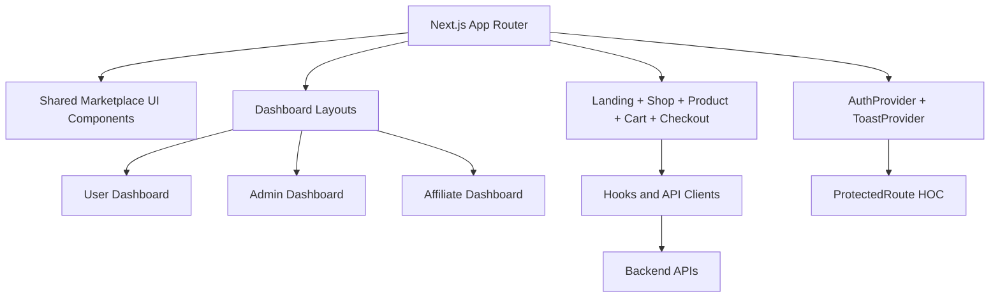

<div align="center">

```
  ██╗███████╗██╗  ██╗ ██████╗ ██████╗      ███╗   ██╗███████╗ ██████╗ ███╗   ██╗    ███████╗██╗  ██╗
  ██║██╔════╝██║  ██║██╔═══██╗██╔══██╗     ████╗  ██║██╔════╝██╔═══██╗████╗  ██║    ██╔════╝╚██╗██╔╝
  ██║███████╗███████║██║   ██║██████╔╝     ██╔██╗ ██║█████╗  ██║   ██║██╔██╗ ██║    █████╗   ╚███╔╝
  ██║╚════██║██╔══██║██║   ██║██╔═══╝      ██║╚██╗██║██╔══╝  ██║   ██║██║╚██╗██║    ██╔══╝   ██╔██╗
  ██║███████║██║  ██║╚██████╔╝██║          ██║ ╚████║███████╗╚██████╔╝██║ ╚████║    ██║     ██╔╝ ██╗
  ╚═╝╚══════╝╚═╝  ╚═╝ ╚═════╝ ╚═╝          ╚═╝  ╚═══╝╚══════╝ ╚═════╝ ╚═╝  ╚═══╝    ╚═╝     ╚═╝  ╚═╝
```

# iSHOP Marketplace

**A full-stack dropshipping automation platform with a professional marketplace UI/UX.**

[](https://github.com/iShopp/app/actions/workflows/ci.yml)
[](LICENSE)
[](https://nextjs.org)
[](https://nestjs.com)
[](https://www.typescriptlang.org)
[](https://www.prisma.io)

</div>

---

## Table of Contents

- [Latest Marketplace Redesign](#latest-marketplace-redesign)
- [UI Screenshots](#ui-screenshots)
- [Features](#features)
- [Architecture](#architecture)
- [Repository Structure](#repository-structure)
- [Quick Start (User Guide)](#quick-start-user-guide)
- [Developer Guide](#developer-guide)
  - [Prerequisites](#prerequisites)
  - [Environment Variables](#environment-variables)
  - [Frontend Setup](#frontend-setup)
  - [Backend Setup](#backend-setup)
  - [Running Everything Together](#running-everything-together)
- [CLI Command Reference](#cli-command-reference)
- [API Reference](#api-reference)
- [CI/CD](#cicd)
- [Security](#security)
- [Contributing](#contributing)

---

## Latest Marketplace Redesign

### Enhanced UI — Premium Dark / Glow Theme

The interface was redesigned from a neutral light theme to a **premium dark marketplace** with:

- **Flash-glow CTAs** — the hero "Start Shopping" button pulses with an orange glow animation (`animate-flash-glow`)
- **Neon accents** — orange (`#f97316`) primary + cyan (`#22d3ee`) secondary on `#020617` background
- **Glassmorphism cards** — `.glass` utility with `backdrop-filter: blur(16px)` and subtle border
- **Skeleton loaders** — shimmer `.skeleton` class for all async states
- **Glow tabs** — `.glow-tab` class with an underline glow on active/hover
- **Mobile-first** — bottom navigation on `< md`, touch-friendly tap targets throughout

### New screenshots (live links)

- Landing page: https://github.com/user-attachments/assets/1f91c561-7679-47d0-b47a-21f2ae4f8a0f
- User dashboard: https://github.com/user-attachments/assets/4455c891-f75b-473d-9a55-6e20d3196b66
- Admin dashboard: https://github.com/user-attachments/assets/6009d7c7-99ef-4a5d-bffe-81ed74eeb614
- Affiliate dashboard: https://github.com/user-attachments/assets/59ab31e1-fe90-4560-9d10-8f9fa5e33c46

### Frontend architecture (high-level)



---

## UI Screenshots

> **Design System:** Premium dark marketplace — `#020617` base, orange (`#f97316`) + cyan (`#22d3ee`) neon accents, glassmorphism cards, flash-glow animated CTAs, and skeleton loading states. Mobile-first with bottom navigation on small screens.

### 🏠 Homepage — Hero / Landing

```
┌─────────────────────────────────────────────────────────────────────────┐
│  ⚡ iSHOP                                      🛒  Sign In  Sign Up     │
├─────────────────────────────────────────────────────────────────────────┤
│  ░░░░░░░░░░░░░░░░░░░░░░░░░░░░░░░░░░░░░░░░░░░░░░░░░░░░░░░░░░░░░░░░░░░  │
│  ░                                                                    ░  │
│  ░   ⚡ Deals refreshed every hour                                    ░  │
│  ░                                                                    ░  │
│  ░   Shop Global.  ✨ Pay Less.                                        ░  │
│  ░   ─────────────────────────────                                    ░  │
│  ░   Curated products from Temu, AliExpress, Amazon, eBay & Lazada    ░  │
│  ░                                                                    ░  │
│  ░   [◀━━ Start Shopping (glow) ━━▶]   [Today's Deals]               ░  │
│  ░                                                                    ░  │
│  ░░░░░░░░░░░░░░░░░░░░░░░░░░░░░░░░░░░░░░░░░░░░░░░░░░░░░░░░░░░░░░░░░░░  │
│                                                                          │
│  ┌───────────┐  ┌───────────┐  ┌───────────┐  ┌───────────┐            │
│  │ 🔴 temu  │  │ 🔵 ali   │  │ 🟠 amz   │  │ 🟣 lazada│  Trending   │
│  │ $29.99   │  │ $15.99   │  │ $24.99   │  │ $39.99   │            │
│  └───────────┘  └───────────┘  └───────────┘  └───────────┘            │
│                                                                          │
│  ┌──────────────────────┐  ┌──────────────────────┐  ┌────────────────┐ │
│  │ 🛡 Buyer Protection  │  │ 📦 Live Tracking     │  │ 💳 Stripe Pay │ │
│  └──────────────────────┘  └──────────────────────┘  └────────────────┘ │
└─────────────────────────────────────────────────────────────────────────┘
```

### 🛍️ Shop / Product Listing

```
┌─────────────────────────────────────────────────────────────────────────┐
│  Filters ▼    Sort: Best Match ▼                        📦 128 results  │
├──────────────────┬──────────────────────────────────────────────────────┤
│                  │  ┌──────────┐  ┌──────────┐  ┌──────────┐           │
│  Categories      │  │ [image]  │  │ [image]  │  │ [image]  │           │
│  ──────────      │  │ Product  │  │ Product  │  │ Product  │           │
│  ● Electronics   │  │ Title    │  │ Title    │  │ Title    │           │
│  ○ Fashion       │  │ ★★★★☆ 4.2│  │ ★★★★★ 5.0│  │ ★★★☆☆ 3.1│           │
│  ○ Home & Garden │  │ $29.99   │  │ $49.99   │  │ $19.99   │           │
│  ○ Sports        │  │[Add Cart]│  │[Add Cart]│  │[Add Cart]│           │
│                  │  └──────────┘  └──────────┘  └──────────┘           │
│  Price Range     │                                                       │
│  $0 ────── $500  │  ┌──────────┐  ┌──────────┐  ┌──────────┐           │
│                  │  │ [image]  │  │ [image]  │  │ [image]  │           │
│  Marketplaces    │  │ ...      │  │ ...      │  │ ...      │           │
│  ☑ AliExpress    │  └──────────┘  └──────────┘  └──────────┘           │
│  ☑ Temu          │                                                       │
│  ☑ Amazon        │                            ← 1  2  3  4  5 →        │
└──────────────────┴──────────────────────────────────────────────────────┘
```

### 🔐 Authentication Pages (Sign In / Sign Up)

```
┌─────────────────────────────┐     ┌─────────────────────────────┐
│   ⚡ iSHOP                  │     │   ⚡ iSHOP                  │
│                             │     │                             │
│   Welcome back              │     │   Create your account      │
│   Sign in to your account   │     │   Join iSHOP NEON FX today  │
│                             │     │                             │
│  ┌───────────────────────┐  │     │  ┌───────────────────────┐  │
│  │ ✉ Email               │  │     │  │ 👤 Full Name          │  │
│  └───────────────────────┘  │     │  └───────────────────────┘  │
│  ┌───────────────────────┐  │     │  ┌───────────────────────┐  │
│  │ 🔒 Password        👁 │  │     │  │ ✉ Email               │  │
│  └───────────────────────┘  │     │  └───────────────────────┘  │
│                             │     │  ┌───────────────────────┐  │
│  [◀━━━━ SIGN IN ━━━━▶]     │     │  │ 🔒 Password        👁 │  │
│         ── or ──            │     │  └───────────────────────┘  │
│  [ Google ]  [ Apple ]      │     │                             │
│                             │     │  [◀━━━ CREATE ACCOUNT ━━▶] │
│  Don't have an account?     │     │                             │
│  Sign up →                  │     │  Already have an account?   │
└─────────────────────────────┘     │  Sign in →                  │
                                    └─────────────────────────────┘
```

### 👤 User Dashboard

```
┌─────────────────────────────────────────────────────────────────────────┐
│  ⚡ iSHOP                                        Welcome back, Alex 👋  │
├──────────────┬──────────────────────────────────────────────────────────┤
│              │                                                           │
│  📊 Overview │  ┌──────────────┐ ┌──────────────┐ ┌──────────────┐    │
│  📦 Orders   │  │  📦 Orders   │ │  ❤️ Wishlist  │ │  💰 Savings  │    │
│  ❤️ Wishlist  │  │     12       │ │     8        │ │   $47.32     │    │
│  🎫 Coupons  │  └──────────────┘ └──────────────┘ └──────────────┘    │
│  📍 Addresses│                                                           │
│  💳 Payment  │  Recent Orders                                           │
│  ⚙️  Settings │  ┌─────────────────────────────────────────────────┐   │
│              │  │ ORD-001  •  3 items  •  $89.97  •  ✅ Delivered  │   │
│              │  │ ORD-002  •  1 item   •  $29.99  •  🚚 Shipped    │   │
│              │  │ ORD-003  •  2 items  •  $54.98  •  ⏳ Processing  │   │
│              │  └─────────────────────────────────────────────────┘   │
└──────────────┴──────────────────────────────────────────────────────────┘
```

### ⚙️ Admin Dashboard

```
┌─────────────────────────────────────────────────────────────────────────┐
│  ⚡ iSHOP Admin                                          admin@shop.com  │
├─────────────────┬───────────────────────────────────────────────────────┤
│                 │                                                         │
│  📊 Dashboard   │  ┌──────────┐ ┌──────────┐ ┌──────────┐ ┌──────────┐│
│  📦 Products ▼  │  │ Revenue  │ │ Orders   │ │ Products │ │  Users   ││
│    Categories   │  │$124,832  │ │  1,247   │ │  8,934   │ │  3,521   ││
│    Brands       │  │ +12.5% ↑ │ │ +8.3% ↑  │ │ +2.1% ↑  │ │ +5.7% ↑  ││
│    Import       │  └──────────┘ └──────────┘ └──────────┘ └──────────┘│
│  🛒 Orders      │                                                         │
│  👥 Users       │  Sales Trend (last 30 days)                            │
│  🎯 Affiliates  │  ╭────────────────────────────────────────────╮       │
│  🎫 Coupons     │  │      ▁▂▃▄▅▆▇█▇▆▅▆▇█████▇▆▇███▇▆▅▆▇      │       │
│  🔖 Banners     │  ╰────────────────────────────────────────────╯       │
│  💹 Pricing     │                                                         │
│  🤖 Automation  │  Top Products                   Recent Activity        │
│  🏪 Marketplaces│  1. Wireless Headphones $89.99  • Order #1247 placed  │
│  🧠 AI Builder  │  2. Leather Wallet      $34.99  • User registered     │
│  📈 Analytics   │  3. Smart Watch         $129.99 • Product imported    │
│  ⚙️  Settings    │                                                         │
└─────────────────┴───────────────────────────────────────────────────────┘
```

### 🌐 Marketplace Proxy (Search)

```
┌─────────────────────────────────────────────────────────────────────────┐
│  Search Marketplace Products                                             │
│                                                                          │
│  ┌──────────────────────────────────────────┐  [AliExpress ▼]  [🔍]    │
│  │ Search products (e.g. wireless headphones)│                          │
│  └──────────────────────────────────────────┘                          │
│                                                                          │
│  Supported: AliExpress · Temu · Amazon · eBay · Lazada                  │
│                                                                          │
│  ┌──────────────┐  ┌──────────────┐  ┌──────────────┐                  │
│  │  AliExpress  │  │    Amazon    │  │    Lazada    │                  │
│  │ [image]      │  │ [image]      │  │ [image]      │                  │
│  │ Wireless     │  │ Premium      │  │ Smart Watch   │                  │
│  │ Headphones   │  │ Headphones   │  │              │                  │
│  │ 🌐 $12.99   │  │ 🌐 $89.99   │  │ 🌐 $29.99   │                  │
│  │ [+ Import]   │  │ [+ Import]   │  │ [+ Import]   │                  │
│  └──────────────┘  └──────────────┘  └──────────────┘                  │
└─────────────────────────────────────────────────────────────────────────┘
```

### 🤝 Affiliate Dashboard

```
┌─────────────────────────────────────────────────────────────────────────┐
│  ⚡ iSHOP Affiliate                                     John Smith 🔗   │
├──────────────────┬──────────────────────────────────────────────────────┤
│                  │                                                        │
│  📊 Overview     │  ┌──────────────┐  ┌──────────────┐  ┌────────────┐ │
│  🔗 Links        │  │  Total       │  │  Conversions │  │  Pending   │ │
│  💰 Earnings     │  │  Earnings    │  │   This Month │  │  Payout    │ │
│  📈 Conversions  │  │  $2,847.50   │  │    47        │  │  $312.00   │ │
│  🖼️  Banners      │  └──────────────┘  └──────────────┘  └────────────┘ │
│  ⚙️  Settings     │                                                        │
│                  │  Your Referral Link                                   │
│                  │  ┌──────────────────────────────────────────┐        │
│                  │  │ https://ishop.com/?ref=JOHN123      [📋] │        │
│                  │  └──────────────────────────────────────────┘        │
│                  │                                                        │
│                  │  Commission Rate: 8%   Cookie: 30 days               │
└──────────────────┴──────────────────────────────────────────────────────┘
```

---

## Features

### Storefront (Frontend)

| Feature | Description |
|---------|-------------|
| 🎨 Premium Glow UI | Dark theme with orange/blue neon accents, glassmorphism, and flash-glow animations |
| 📱 Responsive PWA | Mobile-first layout with bottom navigation, installable as a Progressive Web App |
| 🛒 Cart & Checkout | Persistent cart (localStorage), multi-step checkout, coupon codes, Stripe integration |
| 🔍 Product Search | Debounced search with filters, sorting, and marketplace source filter |
| 🏷️ Categories & Brands | Browsable taxonomy with dedicated listing pages |
| ❤️ Wishlist | Save-for-later with backend persistence (per-user API) |
| ⭐ Reviews & Ratings | Product reviews with star rating UI; rating aggregated automatically |
| 👤 User Accounts | Order history, address book, payment methods, settings |
| 🤝 Affiliate Portal | Referral links, commission tracking, payout requests |
| 🔔 Notifications | In-app notification centre with mark-read |
| 🔐 Auth Flows | Sign-in, sign-up, refresh tokens, forgot/reset password, email verification |
| 🛡️ Protected Routes | Role-based `ProtectedRoute` HOC for customer / affiliate / admin areas |
| 🗺️ SEO | `sitemap.xml` + `robots.txt` generated via Next.js Metadata API |

### Admin Panel

| Feature | Description |
|---------|-------------|
| 📦 Product Management | CRUD, bulk import from marketplaces, variant/image management |
| 🛒 Order Management | Status tracking, supplier fulfillment, timeline |
| 💹 Dynamic Pricing | Rule-based markup engine (%, fixed, per-marketplace) — configurable 10–20%+ |
| 🤖 Automation | BullMQ job queues — price sync, stock sync, order fulfillment, image optimisation |
| 🌐 Marketplace Proxy | Unified search across AliExpress, Temu, Amazon, eBay, **Lazada** |
| 🧠 AI Builder | OpenAI gpt-4o-mini — product descriptions, SEO tags, FAQs, pricing strategy |
| 📈 Analytics | Revenue, orders, users KPIs with AI-powered insights |
| 🎫 Coupons | % off, fixed, free-shipping coupons with usage limits |
| 🔖 Banners | Promotional banners with position targeting |
| 💳 Payments | Stripe payment intents, webhook handler, PaymentStatus tracking |
| 📧 Email Templates | Resend-powered transactional emails — order, shipping, welcome, password reset |
| 🔔 Notifications | Admin-creatable in-app notifications for users |
| ⚡ Rate Limiting | Global `ThrottlerGuard` — 60 requests / 60 s per IP |

---

## Architecture

```
┌─────────────────────────────────────────────────────────────────────────┐
│                                                                          │
│   Browser / Mobile                                                       │
│      │                                                                   │
│      ▼                                                                   │
│   ┌─────────────────────────────────────────────┐                       │
│   │  Next.js 15  (frontend/)                    │                       │
│   │  App Router · TypeScript · Tailwind CSS     │                       │
│   │  React 19 · next-pwa · Zustand (hooks)      │                       │
│   └─────────────────────┬───────────────────────┘                       │
│                          │  REST API  (HTTP/JSON)                        │
│                          ▼                                               │
│   ┌─────────────────────────────────────────────┐                       │
│   │  NestJS 11  (backend/)                      │                       │
│   │  JWT Auth · Guards · Swagger · Helmet       │                       │
│   │  ValidationPipe · TransformInterceptor      │                       │
│   └──────┬─────────────────┬────────────────────┘                       │
│          │                 │                                             │
│          ▼                 ▼                                             │
│   ┌──────────────┐  ┌─────────────────────┐                             │
│   │ PostgreSQL   │  │  Redis + BullMQ      │                             │
│   │ (Prisma ORM) │  │  5 worker queues     │                             │
│   └──────────────┘  └─────────────────────┘                             │
│                                                                          │
│   External: AliExpress · Temu · Amazon PAAPI · eBay · Lazada · OpenAI · Stripe · Resend            │
│                                                                          │
└─────────────────────────────────────────────────────────────────────────┘
```

---

## Repository Structure

```
app/
├── .github/
│   └── workflows/
│       ├── ci.yml            # Lint, type-check, build + unit tests on every push/PR
│       └── cd.yml            # Production deploy (Vercel + Docker/Railway)
├── frontend/                 # Next.js 15 App Router frontend
│   ├── public/
│   │   └── manifest.json     # PWA manifest
│   ├── src/
│   │   ├── app/              # File-based routing (App Router)
│   │   │   ├── layout.tsx            # Root layout (Navbar, Footer, providers)
│   │   │   ├── page.tsx              # Homepage
│   │   │   ├── globals.css           # Tailwind base + NEON FX custom properties
│   │   │   ├── auth/
│   │   │   │   ├── signin/page.tsx   # Sign in → calls useAuth().signIn()
│   │   │   │   └── signup/page.tsx   # Sign up → calls useAuth().signUp()
│   │   │   ├── shop/
│   │   │   │   ├── page.tsx          # All products
│   │   │   │   └── [category]/page.tsx
│   │   │   ├── product/
│   │   │   │   └── [slug]/page.tsx   # Product detail (async params)
│   │   │   ├── brands/
│   │   │   │   ├── page.tsx
│   │   │   │   └── [slug]/page.tsx
│   │   │   ├── search/page.tsx
│   │   │   ├── cart/page.tsx
│   │   │   ├── checkout/page.tsx
│   │   │   ├── deals/page.tsx
│   │   │   ├── affiliates/page.tsx
│   │   │   ├── users/                # Customer portal (requires auth)
│   │   │   │   ├── layout.tsx
│   │   │   │   ├── page.tsx          # Dashboard overview
│   │   │   │   ├── orders/
│   │   │   │   │   ├── page.tsx
│   │   │   │   │   └── [id]/page.tsx
│   │   │   │   ├── wishlist/page.tsx
│   │   │   │   ├── coupons/page.tsx
│   │   │   │   ├── addresses/page.tsx
│   │   │   │   ├── payment/page.tsx
│   │   │   │   ├── track/page.tsx
│   │   │   │   └── settings/page.tsx
│   │   │   ├── admin/                # Admin panel (requires admin role)
│   │   │   │   ├── layout.tsx
│   │   │   │   ├── page.tsx          # KPI dashboard
│   │   │   │   ├── products/
│   │   │   │   │   ├── page.tsx
│   │   │   │   │   ├── categories/page.tsx
│   │   │   │   │   ├── brands/page.tsx
│   │   │   │   │   └── import/page.tsx
│   │   │   │   ├── orders/
│   │   │   │   │   ├── page.tsx
│   │   │   │   │   └── supplier/page.tsx
│   │   │   │   ├── marketplaces/
│   │   │   │   │   ├── page.tsx
│   │   │   │   │   └── [name]/page.tsx  # Per-marketplace search (React.use params)
│   │   │   │   ├── analytics/
│   │   │   │   │   ├── page.tsx
│   │   │   │   │   └── ai/page.tsx
│   │   │   │   ├── affiliates/page.tsx
│   │   │   │   ├── automation/page.tsx
│   │   │   │   ├── banners/page.tsx
│   │   │   │   ├── builder/page.tsx
│   │   │   │   ├── coupons/page.tsx
│   │   │   │   ├── pricing/page.tsx
│   │   │   │   └── settings/page.tsx
│   │   │   └── affiliate/            # Affiliate portal
│   │   │       ├── layout.tsx
│   │   │       ├── page.tsx
│   │   │       ├── links/page.tsx
│   │   │       ├── earnings/page.tsx
│   │   │       ├── conversions/page.tsx
│   │   │       ├── banners/page.tsx
│   │   │       └── settings/page.tsx
│   │   ├── components/
│   │   │   ├── layout/
│   │   │   │   ├── Navbar.tsx        # Top navigation bar
│   │   │   │   ├── Footer.tsx        # Site footer
│   │   │   │   └── MobileNav.tsx     # Mobile bottom navigation
│   │   │   ├── ui/
│   │   │   │   ├── Button.tsx        # Primary / ghost / outline button variants
│   │   │   │   ├── Card.tsx          # Surface card with glow border
│   │   │   │   ├── ProductCard.tsx   # Product tile with add-to-cart
│   │   │   │   ├── Badge.tsx         # Status/label badge
│   │   │   │   ├── LoadingSpinner.tsx
│   │   │   │   ├── RatingStars.tsx   # 5-star display
│   │   │   │   ├── ReviewList.tsx    # Review list renderer
│   │   │   │   ├── TrustBadge.tsx    # Trust signal badges
│   │   │   │   ├── Toast.tsx         # Toast notification provider (4 types, auto-dismiss)
│   │   │   │   └── WriteReview.tsx   # Interactive 5-star review form
│   │   │   ├── auth/
│   │   │   │   └── ProtectedRoute.tsx # Role-based HOC with loading state
│   │   │   ├── admin/
│   │   │   │   ├── KPICard.tsx
│   │   │   │   └── Sidebar.tsx
│   │   │   ├── affiliate/
│   │   │   │   └── Sidebar.tsx
│   │   │   └── users/
│   │   │       └── Sidebar.tsx
│   │   ├── hooks/
│   │   │   ├── useAuth.ts    # Standalone auth hook (legacy — prefer AuthContext)
│   │   │   └── useCart.ts    # Cart state → localStorage, deduplicated
│   │   ├── lib/
│   │   │   ├── api.ts        # All API clients (products, orders, reviews, wishlist, notifications…)
│   │   │   ├── auth-context.tsx  # AuthProvider + useAuthContext (global auth state)
│   │   │   ├── constants.ts  # App-wide constants
│   │   │   └── utils.ts      # cn(), formatPrice(), debounce()
│   │   └── types/
│   │       └── index.ts      # Shared TypeScript interfaces (Product, User, Order, Review…)
│   ├── next.config.js
│   ├── tailwind.config.ts
│   ├── tsconfig.json
│   └── package.json
│
└── backend/                   # NestJS 11 REST API
    ├── prisma/
    │   └── schema.prisma      # 27 models, 9 enums (PostgreSQL)
    ├── src/
    │   ├── main.ts            # Bootstrap: helmet, CORS, Swagger, ValidationPipe
    │   ├── app.module.ts      # Root module (imports all feature modules)
    │   ├── auth/              # JWT auth, refresh tokens, password reset, email verification
    │   │   ├── auth.controller.ts   # POST signup/signin/refresh/signout/forgot-password/reset-password/verify-email
    │   │   ├── auth.service.ts      # Refresh token rotation (30d), bcrypt, password reset (24h)
    │   │   ├── auth.module.ts
    │   │   ├── auth.service.spec.ts # Unit tests (7 passing)
    │   │   ├── strategies/
    │   │   │   ├── jwt.strategy.ts
    │   │   │   └── local.strategy.ts
    │   │   ├── guards/
    │   │   │   ├── jwt-auth.guard.ts
    │   │   │   └── roles.guard.ts
    │   │   └── decorators/
    │   │       └── roles.decorator.ts
    │   ├── users/             # User CRUD — ownership enforced
    │   ├── products/          # Product CRUD with search/filter
    │   ├── categories/        # Category tree
    │   ├── brands/            # Brand management
    │   ├── orders/            # Order placement (server-side pricing), status tracking
    │   ├── reviews/           # Product reviews + automatic rating aggregation
    │   ├── wishlist/          # Per-user wishlist (add/remove/check/clear)
    │   ├── notifications/     # In-app notifications with mark-read
    │   ├── affiliates/        # Affiliate accounts and links
    │   ├── coupons/           # Coupon CRUD + authenticated validation
    │   ├── pricing/           # Rule-based pricing engine (%, fixed, per-marketplace)
    │   ├── banners/           # Promotional banner management
    │   ├── analytics/         # Revenue, orders, user KPIs
    │   ├── payments/          # Stripe payment intents, confirm, webhook handler
    │   ├── email/             # Resend transactional email (order, shipping, password reset)
    │   ├── ai/                # OpenAI gpt-4o-mini content generation
    │   ├── builder/           # AI-powered store suggestion engine
    │   ├── proxy/             # Marketplace proxy (AliExpress, Temu, Amazon, eBay, Lazada)
    │   │   └── adapters/      # Per-marketplace adapter pattern
    │   ├── workers/           # BullMQ job processors (5 queues)
    │   ├── prisma/            # PrismaService (singleton)
    │   └── common/            # Shared DTOs, interceptors
    ├── .env.example
    ├── nest-cli.json
    ├── tsconfig.json
    └── package.json
```

---

## Quick Start (User Guide)

### Browsing the Store

1. Navigate to the store URL (or `http://localhost:3000` locally).
2. Browse products on the **Shop** page, or use the search bar at the top.
3. Filter by **category**, **brand**, or **price range** in the left sidebar.
4. Click any product card to view the full product detail page.

### Creating an Account

1. Click **Sign Up** in the top navigation.
2. Enter your name, email, and a password (min. 8 characters).
3. Click **Create Account** — you'll be redirected to your dashboard.

### Placing an Order

1. Add items to your cart using the **Add to Cart** button on any product.
2. Click the 🛒 cart icon in the navigation to review your cart.
3. Proceed to **Checkout**, enter your shipping address, and apply any coupon codes.
4. Complete payment to place your order.

### Tracking Orders

- Visit **My Account → Orders** to see all your orders and their current status.
- Click any order to view the full timeline (Pending → Processing → Shipped → Delivered).

### Using Coupon Codes

- Enter your coupon code in the cart or at checkout.
- Valid coupons will show the discount amount before you confirm.

### Becoming an Affiliate

1. Visit the **Affiliates** page and apply to join the program.
2. Once approved, log in and go to the **Affiliate Portal** (`/affiliate`).
3. Copy your unique referral link from **My Links**.
4. Share it — earn commission on every sale you refer.

---

## Developer Guide

### Prerequisites

| Tool | Minimum Version | Notes |
|------|----------------|-------|
| Node.js | 20.x LTS | Use [nvm](https://github.com/nvm-sh/nvm) |
| npm | 10.x | Comes with Node 20 |
| PostgreSQL | 14+ | Or use Docker |
| Redis | 6+ | Or use Docker |
| Git | 2.x | |

### Environment Variables

#### Backend (`backend/.env`)

Copy the example and fill in your values:

```bash
cp backend/.env.example backend/.env
```

| Variable | Required | Description |
|----------|----------|-------------|
| `DATABASE_URL` | ✅ | PostgreSQL connection string |
| `JWT_SECRET` | ✅ | **Strong random secret** — app won't start without this |
| `JWT_EXPIRES_IN` | ✅ | Access token TTL (e.g. `15m`, `1h`) |
| `JWT_REFRESH_SECRET` | ✅ | Separate secret for refresh tokens |
| `JWT_REFRESH_EXPIRES_IN` | ✅ | Refresh token TTL (default `30d`) |
| `REDIS_URL` | ✅ | Redis connection string for BullMQ queues |
| `PORT` | ✅ | API server port (default `3001`) |
| `NODE_ENV` | ✅ | `development` / `production` / `test` |
| `FRONTEND_URL` | ✅ | Production frontend URL — used in CORS and email links |
| `OPENAI_API_KEY` | ⬜ | Required for AI Builder and AI Analytics |
| `STRIPE_SECRET_KEY` | ⬜ | Stripe server-side secret key |
| `STRIPE_WEBHOOK_SECRET` | ⬜ | Stripe webhook signing secret |
| `RESEND_API_KEY` | ⬜ | Resend transactional email API key |
| `RESEND_FROM_EMAIL` | ⬜ | Sender address (e.g. `noreply@yourdomain.com`) |
| `TEMU_API_KEY` | ⬜ | Temu marketplace adapter |
| `ALIEXPRESS_APP_KEY` | ⬜ | AliExpress Open Platform App Key |
| `ALIEXPRESS_APP_SECRET` | ⬜ | AliExpress Open Platform App Secret |
| `AMAZON_ACCESS_KEY` | ⬜ | Amazon Product Advertising API 5.0 |
| `AMAZON_SECRET_KEY` | ⬜ | Amazon PAAPI5 secret |
| `AMAZON_PARTNER_TAG` | ⬜ | Amazon Associates tag |
| `EBAY_APP_ID` | ⬜ | eBay Developer App ID |
| `LAZADA_APP_KEY` | ⬜ | Lazada Open Platform App Key |
| `LAZADA_APP_SECRET` | ⬜ | Lazada Open Platform App Secret |

#### Frontend (`frontend/.env.local`)

```bash
# frontend/.env.local
NEXT_PUBLIC_API_URL=http://localhost:3001
NEXT_PUBLIC_SITE_URL=https://yourdomain.com
NEXT_PUBLIC_STRIPE_PUBLISHABLE_KEY=pk_test_...
```

### Frontend Setup

```bash
cd frontend
npm install --legacy-peer-deps
npm run dev          # Start development server on http://localhost:3000
```

### Backend Setup

```bash
cd backend
cp .env.example .env
# Edit .env — set DATABASE_URL, JWT_SECRET, REDIS_URL at minimum

npm install

# Generate Prisma client
npx prisma generate

# Create database and run all migrations
npx prisma migrate dev --name init

# (Optional) Seed the database
# npx prisma db seed

# Start development server with hot-reload
npm run start:dev    # API at http://localhost:3001
                     # Swagger UI at http://localhost:3001/api/docs
```

### Running Everything Together

#### Option A — Two terminals

```bash
# Terminal 1 — Frontend
cd frontend && npm run dev

# Terminal 2 — Backend
cd backend && npm run start:dev
```

#### Option B — Docker Compose (recommended for production-like local dev)

> Create a `docker-compose.yml` at the project root if you need a containerised setup.

```yaml
# docker-compose.yml (example)
version: '3.9'
services:
  postgres:
    image: postgres:16
    environment:
      POSTGRES_DB: ishop_neon_fx
      POSTGRES_USER: postgres
      POSTGRES_PASSWORD: postgres
    ports: ['5432:5432']

  redis:
    image: redis:7-alpine
    ports: ['6379:6379']
```

```bash
docker compose up -d      # Start Postgres + Redis
cd backend && npm run start:dev
cd frontend && npm run dev
```

---

## CLI Command Reference

### Frontend Commands

```bash
cd frontend

npm run dev           # Start Next.js dev server (http://localhost:3000)
npm run build         # Production build → .next/
npm run start         # Start production server (requires npm run build first)
npm run lint          # Run ESLint
npm run type-check    # Run tsc --noEmit (zero TypeScript errors required)
```

### Backend Commands

```bash
cd backend

# ── Development ─────────────────────────────────────────────────────────────
npm run start:dev     # NestJS dev server with hot-reload (http://localhost:3001)

# ── Build & Production ───────────────────────────────────────────────────────
npm run build         # Compile TypeScript → dist/
npm run start:prod    # Run compiled production build

# ── Testing ─────────────────────────────────────────────────────────────────
npm test              # Run all unit tests
npm run test:watch    # Watch mode
npm run test:cov      # Coverage report → coverage/
npm run test:e2e      # End-to-end tests

# ── Code Quality ─────────────────────────────────────────────────────────────
npm run lint          # ESLint + auto-fix

# ── Prisma / Database ────────────────────────────────────────────────────────
npx prisma generate          # Regenerate Prisma client from schema
npx prisma migrate dev       # Create + apply a new migration (dev)
npx prisma migrate deploy    # Apply pending migrations (production)
npx prisma migrate reset     # ⚠️  Drop database and re-run all migrations
npx prisma studio            # Open Prisma Studio GUI (http://localhost:5555)
npx prisma db pull           # Introspect existing DB → update schema.prisma
npx prisma db push           # Push schema changes without a migration file
npx prisma format            # Format schema.prisma
```

### CI / Type-Check (both workspaces)

```bash
# From repo root — run these before pushing to keep CI green:
cd frontend && npx tsc --noEmit && cd ..
cd backend  && npx tsc --noEmit && cd ..
```

---

## API Reference

Swagger UI is available at **`http://localhost:3001/api/docs`** when the backend is running.

### Authentication

| Endpoint | Method | Auth | Description |
|----------|--------|------|-------------|
| `/auth/signup` | `POST` | Public | Register a new user |
| `/auth/signin` | `POST` | Public | Get JWT access + refresh tokens |
| `/auth/me` | `GET` | JWT | Get current user profile |
| `/auth/refresh` | `POST` | Public | Rotate refresh token → new access + refresh tokens |
| `/auth/signout` | `POST` | JWT | Invalidate refresh token |
| `/auth/forgot-password` | `POST` | Public | Request password-reset email |
| `/auth/reset-password` | `POST` | Public | Reset password using token |
| `/auth/verify-email` | `POST` | Public | Verify email address using token |

### Users

| Endpoint | Method | Auth | Description |
|----------|--------|------|-------------|
| `/users` | `GET` | Admin | List all users (paginated) |
| `/users/:id` | `GET` | JWT (own or Admin) | Get user profile |
| `/users/:id` | `PATCH` | JWT (own or Admin) | Update user profile |
| `/users/:id` | `DELETE` | Admin | Delete user |

### Products, Categories, Brands

| Endpoint | Method | Auth | Description |
|----------|--------|------|-------------|
| `/products` | `GET` | Public | List/search products |
| `/products/:id` | `GET` | Public | Get product detail |
| `/products` | `POST` | Admin | Create product |
| `/products/:id` | `PATCH` | Admin | Update product |
| `/products/:id` | `DELETE` | Admin | Delete product |
| `/categories` | `GET/POST/PATCH/DELETE` | Public / Admin | Category CRUD |
| `/brands` | `GET/POST/PATCH/DELETE` | Public / Admin | Brand CRUD |

### Orders

| Endpoint | Method | Auth | Description |
|----------|--------|------|-------------|
| `/orders` | `GET` | JWT | List orders (admin = all; customer = own) |
| `/orders/:id` | `GET` | JWT (own or Admin) | Get order (ownership enforced) |
| `/orders` | `POST` | JWT | Create order (prices fetched server-side) |
| `/orders/:id/status` | `PATCH` | Admin | Update order status |

### Coupons

| Endpoint | Method | Auth | Description |
|----------|--------|------|-------------|
| `/coupons/validate` | `GET` | JWT | Validate a coupon code |
| `/coupons` | `GET/POST/PATCH/DELETE` | Admin | Coupon CRUD |

### Proxy (Marketplace Search)

| Endpoint | Method | Auth | Description |
|----------|--------|------|-------------|
| `/proxy/search` | `GET` | JWT | Search products on a marketplace |
| `/proxy/products/:marketplace/:id` | `GET` | JWT | Get product from marketplace |

### Reviews

| Endpoint | Method | Auth | Description |
|----------|--------|------|-------------|
| `/reviews/product/:productId` | `GET` | Public | List reviews for a product |
| `/reviews` | `POST` | JWT | Submit a review (one per user per product) |
| `/reviews/:id` | `DELETE` | JWT (own) | Delete a review |
| `/reviews/:id/helpful` | `POST` | Public | Mark review as helpful |

### Wishlist

| Endpoint | Method | Auth | Description |
|----------|--------|------|-------------|
| `/wishlist` | `GET` | JWT | Get current user's wishlist |
| `/wishlist/items` | `POST` | JWT | Add product to wishlist |
| `/wishlist/items/:productId` | `DELETE` | JWT | Remove product from wishlist |
| `/wishlist/check/:productId` | `GET` | JWT | Check if product is wishlisted |

### Notifications

| Endpoint | Method | Auth | Description |
|----------|--------|------|-------------|
| `/notifications` | `GET` | JWT | List notifications for current user |
| `/notifications/:id/read` | `PATCH` | JWT | Mark notification as read |
| `/notifications/read-all` | `PATCH` | JWT | Mark all notifications as read |

### Payments (Stripe)

| Endpoint | Method | Auth | Description |
|----------|--------|------|-------------|
| `/payments/create-intent/:orderId` | `POST` | JWT | Create a Stripe payment intent |
| `/payments/confirm/:paymentIntentId` | `POST` | JWT | Confirm payment and update order |
| `/payments/webhook` | `POST` | Public (signature) | Stripe webhook handler |

| Endpoint | Method | Auth | Description |
|----------|--------|------|-------------|
| `/automation/stats` | `GET` | Admin | BullMQ queue statistics |
| `/automation/jobs/:type/trigger` | `POST` | Admin | Trigger a job queue |

**Job types:** `price-sync` · `stock-sync` · `order-fulfillment` · `product-import` · `image-optimization`

### AI & Builder (Admin)

| Endpoint | Method | Auth | Description |
|----------|--------|------|-------------|
| `/ai/generate` | `POST` | Admin | Generate AI product content |
| `/builder/suggestions` | `GET/POST` | Admin | AI store builder |

---

## CI/CD

### Continuous Integration (`.github/workflows/ci.yml`)

Runs on every push and pull request:

```
push / pull_request
         │
         ├── Frontend — lint & build
         │     ├── npm ci --legacy-peer-deps
         │     ├── npx tsc --noEmit
         │     └── npm run build
         │
         ├── Backend — lint, type-check & build
         │     ├── npm ci
         │     ├── npx prisma generate
         │     └── npm run build
         │
         └── Backend — unit tests (needs: backend-build)
               ├── npm ci
               ├── npx prisma generate
               └── npm test -- --passWithNoTests
```

### Continuous Deployment (`.github/workflows/cd.yml`)

Runs on push to `main`/`master`:

- **Frontend** — builds and deploys to Vercel (configure `VERCEL_TOKEN`, `VERCEL_ORG_ID`, `VERCEL_PROJECT_ID` in repo secrets).
- **Backend** — builds Docker image and pushes to GHCR, then deploys to Railway / Fly.io (uncomment and configure the relevant steps in `cd.yml`).

---

## Security

This project follows secure-by-default patterns:

| Area | Protection |
|------|-----------|
| JWT Secret | App throws at startup if `JWT_SECRET` env var is not set — no weak fallback |
| Refresh Tokens | DB-stored, single-use (rotated on every refresh), 30-day expiry, wiped on password reset |
| Auth | All non-public endpoints require a valid JWT (`JwtAuthGuard`) |
| Authorization | Ownership checks on user profiles and orders; admin-only endpoints protected by `RolesGuard` |
| Privilege Escalation | `role` field removed from `UpdateUserDto` — role changes require a separate admin-only endpoint |
| Price Manipulation | Client cannot supply item prices; server always looks up authoritative price from the database |
| Coupon Enumeration | `GET /coupons/validate` requires authentication to prevent brute-force enumeration |
| Open Proxy | Marketplace proxy endpoints require JWT to prevent API key abuse |
| Rate Limiting | Global `ThrottlerGuard` — 60 requests per 60 seconds per IP |
| CORS | `localhost` origins allowed only outside production; production requires explicit `FRONTEND_URL` |
| Stripe Webhooks | Signature verified via `stripe.webhooks.constructEvent` before any order updates |
| Dependencies | `next` ≥ 15.5.12, `serialize-javascript` ≥ 7.0.3, `axios` ≥ 1.13.5, `@nestjs/*` ≥ 11 |

**Reporting a vulnerability:** Please open a private security advisory via GitHub rather than a public issue.

---

## Contributing

1. Fork the repository and create a feature branch: `git checkout -b feat/my-feature`
2. Make your changes — ensure `tsc --noEmit` passes in both workspaces.
3. Run lint: `npm run lint` in both `frontend/` and `backend/`.
4. Open a Pull Request against `main`. CI will run automatically.

### Code Style

- TypeScript strict mode — no `any` unless unavoidable.
- NestJS conventions: one module per feature, DTOs with `class-validator`, services handle business logic.
- React: hooks for state, `'use client'` on all interactive components, Next.js 15 async `params`.

---

<div align="center">

Built with ⚡ by the iSHOP NEON FX team  
MIT License — see [LICENSE](LICENSE)

</div> 
